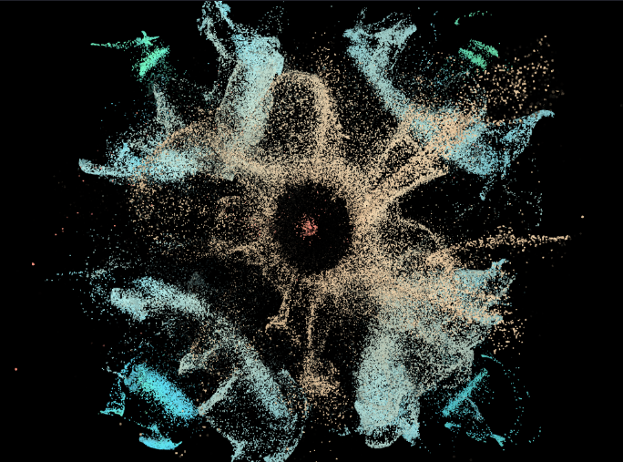

<!DOCTYPE html>
<html lang="ko">
<head>
  <meta charset="UTF-8" />
  <meta name="viewport" content="width=device-width, initial-scale=1" />
  <title>The Sound of the Unseen</title>
  
</head>
<body>

  <nav>
    
The Sound of the Unseen

    

      <a href="#home">Home</a>
      <a href="#concept">Concept</a>
      <a href="#visualization">Visualization</a>
      <a href="#technology">Technology</a>
      <a href="#contact">Contact</a>
    

  </nav>

  <header id="home">
    <video autoplay loop muted playsinline>
      <source src="mainvideo.mp4" type="video/mp4" />
      Your browser does not support the video tag.
    </video>
    

    

      
      <h1>The Sound of the Unseen</h1>
      <h2>감각의 확장</h2>
      
식물의 Biorhythms을 이용한 Sound Visualization

      
Team: 동심

    

  </header>

  <section id="concept">
    <h2>Concept - Abstract</h2>
    

      우리는 사회를 인식할 때 표면적인 정보에만 의존해, 이면 속에 숨어있는 신호를 놓치고 사회를 편향되게 이해할 때가 있습니다.
      본 작품은 식물을 통해 사회를 은유적으로 표현하며, 겉으로 드러나지 않는 수많은 신호가 존재하고 흐른다는 사실을 드러내고자 합니다.
      관객은 이 과정에 직접 개입하며, 감춰진 신호를 인지하고 해석하는 경험을 하게 됩니다.
    

    

      식물은 끊임없이 미세한 전기적 리듬을 발산하지만, 이는 인간의 감각으로는 감지되지 않습니다. 이는 곧 사회 속 보이지 않는 정보와도 맞닿아 있습니다.
      관객이 식물에 접촉하면, MIDI 컨트롤러 Biotron이 식물의 바이오리듬을 감지해 소리로 변환합니다. 생성된 소리는 다시 사이매틱스 원리를 통해 물리적 패턴을 형성하며,
      이 과정을 웹캠이 실시간으로 인식해 시각적 이미지로 확장합니다.
    

    

      본 작품은 기술을 통해 일상 속에서 볼 수 있는 단순한 매개로부터 감각과 인식의 범위를 확장하며 관객에게 익숙한 사회의 표면을 넘어, 그 이면에 흐르는 신호들을 바라보고
      경험하는 새로운 인식의 가능성을 제안하고자 합니다.
    

  </section>

  <section id="visualization">
    <h2>Exhibition</h2>
    

      
작품 1

      
작품 2

      
작품 3

    

  </section>

  <section id="technology">
    <h2>Technology</h2>
    
TouchDesigner, WebGL, MIDI Controller를 활용한 시각화 기술 설명이 여기에 들어갑니다.

  </section>

  <section id="contact">
    <h2>Contact / Team</h2>
    

      

        
        
정지원

        
개발, 디자인

        
wjdwldnjs427@naver.com

        
010-5873-4277

      

      

        
        
박승민

        
개발, 디자인

        
ligers9999@gmail.com

        
010-4641-0214

      

      

        
        
채승룡

        
기획, 디자인

        
csy1669@naver.com

        
010-3151-1669

      

    

  </section>

  <footer>
    
&copy; 2025 The Sound of the Unseen. All rights reserved.

  </footer>

</body>
</html>
